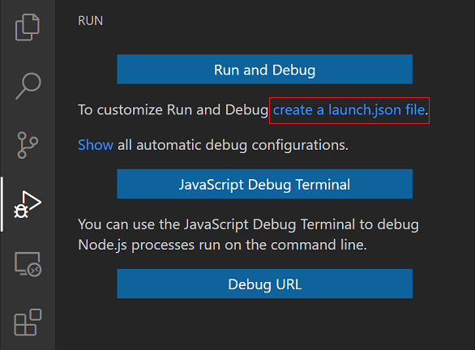
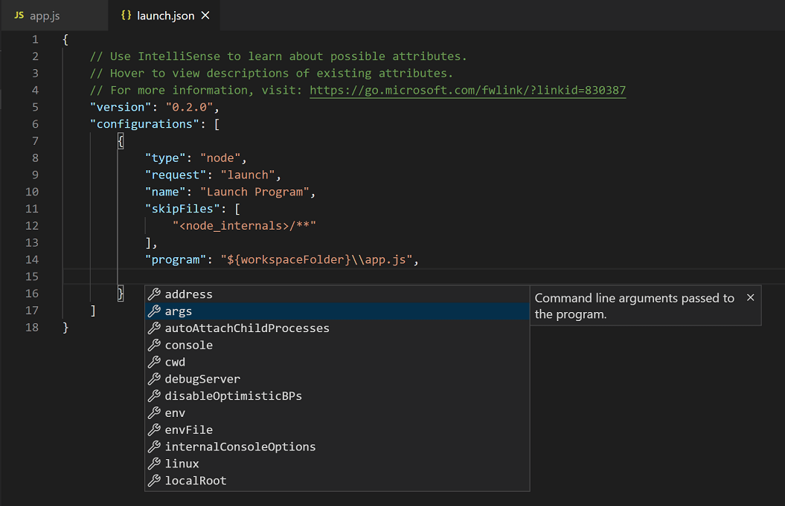

## 1. Installation of VS Code:

### Describe the steps to download and install Visual Studio Code on Windows 11 operating system. Include any prerequisites that might be needed.

Here are the steps to download and install Visual Studio Code (VS Code) on a Windows 11 operating system:

#### Prerequisites:

- Ensure that your Windows 11 system meets the minimum system requirements for running Visual Studio Code.

  - Visual Studio Code is a small download (< 200 MB) and has a disk footprint of < 500 MB. VS Code is lightweight and should easily run on today's hardware.
  - We recommend: 1.6 GHz or faster processor 1 GB of RAM

- Make sure you have a stable internet connection for downloading the installer.

#### Steps to Install Visual Studio Code on Windows

Step 1:

Visit the Official Website (https://code.visualstudio.com/download) of the Visual Studio Code using any web browser like Google Chrome, Microsoft Edge, etc.

Result:


Step 2:

Press the “Download for Windows” button on the website to start the download of the Visual Studio Code Application.

Step 3:

When the download finishes, then the Visual Studio Code Icon appears in the downloads folder.

Result:


Step 4:

Click on the Installer icon to start the installation process of the Visual Studio Code.

Step 5:

After the Installer opens, it will ask you to accept the terms and conditions of the Visual Studio Code. Click on I accept the agreement and then click the Next button.

Result:


Step 6:

Choose the location data for running the Visual Studio Code. It will then ask you to browse the location. Then click on the Next button.

Result:


Step 7:

Then it will ask to begin the installation setup. Click on the Install button.

Result:


Step 8:

After clicking on Install, it will take about 1 minute to install the Visual Studio Code on your device.

Result:


Step 9:

After the Installation setup for Visual Studio Code is finished, it will show a window like this below. Tick the “Launch Visual Studio Code” checkbox and then click Next.

Result:


Step 10:

After the previous step, the Visual Studio Code window opens successfully. Now you can create a new file in the Visual Studio Code window and choose a language to begin with.

Result:


## 2. First-time Setup:

### After installing VS Code, what initial configurations and settings should be adjusted for an optimal coding environment? Mention any important settings or extensions.

After installing Visual Studio Code (VS Code) on a Windows 11 environment, you may want to adjust some initial configurations and settings to optimize your coding experience. Here are some recommended settings to consider:

Font Size and Family:

Adjust the font size and family to improve readability. You can do this by going to File > Preferences > Settings (or pressing Ctrl + ,). Search for "Font Size" and "Font Family," and then modify the values accordingly.

Extensions:

Install extensions to enhance your coding experience. Some popular extensions include:

- Code Spell Checker: Checks for spelling errors in your code.
- GitLens: Provides enhanced Git functionality within VS Code.
- Prettier: Automatically formats your code for consistency.

Terminal Settings:

Customize your integrated terminal settings. You can access these settings by going to File > Preferences > Settings (or pressing Ctrl + ,), searching for "Terminal," and then configuring options such as shell path and font family.

Version Control:

If you're working with version control systems like Git, configure your user settings (username and email) to match your Git account. You can access these settings by going to File > Preferences > Settings (or pressing Ctrl + ,), searching for "Git," and then configuring the options under "Git: Config."

Editor Preferences:

Customize various editor preferences such as line numbers, word wrap, and minimap visibility to suit your workflow. You can access these settings by going to File > Preferences > Settings (or pressing Ctrl + ,) and exploring the available options under "Editor."

## 3. User Interface Overview:

Explain the main components of the VS Code user interface. Identify and describe the purpose of the Activity Bar, Side Bar, Editor Group, and Status Bar.

#### Basic Layout

VS Code comes with a simple and intuitive layout that maximizes the space provided for the editor, while leaving ample room to browse and access the full context of your folder or project. The user interface is divided into five main areas:

- <strong>Editor</strong> - The main area to edit your files. You can open as many editors as you like side by side vertically and horizontally.
- <strong>Primary Side Bar</strong>- Contains different views like the Explorer to assist you while working on your project.
- <strong>Status bar</strong> - Information about the opened project and the files you edit.
- <strong>Activity bar</strong> - Located on the far left-hand side. Lets you switch between views and gives you additional context-specific indicators, like the number of outgoing changes when Git is enabled. You can change the position of the Activity Bar.
- <strong>Panel</strong> - An additional space for views below the editor region. By default, it contains output, debug information, errors and warnings, and an integrated terminal. The Panel can also be moved to the left or right for more vertical space.

Each time you start VS Code, it opens up in the same state it was in when you last closed it. The folder, layout, and opened files are preserved.

Open files in each editor are displayed with tabbed headers (Tabs) at the top of the editor region. To learn more about tabbed headers, see the Tabs section.

## 4. Command palette

The <strong>Command</strong> Palette provides access to many commands. You can run editor commands, open files, search for symbols, and see a quick outline of a file, all using the same interactive window. Here are a few tips:

- ⌘P enables you to navigate to any file or symbol by typing its name
- ⌃Tab cycles you through the last set of files opened
- ⇧⌘P brings you directly to the editor commands
- ⇧⌘O enables you to navigate to a specific symbol in a file
- ⌃G enables you to navigate to a specific line in a file
- Type ? in the input field to get a list of available commands that you can run from the Command Palette.


## 5. Extensions in VS Code

VS Code extensions let you add languages, debuggers, and tools to your installation to support your development workflow. VS Code's rich extensibility model lets extension authors plug directly into the VS Code UI and contribute functionality through the same APIs used by VS Code.

Browse for extensions

You can browse and install extensions from within VS Code. Bring up the Extensions view by clicking on the Extensions icon in the Activity Bar on the side of VS Code or the View: Extensions command (⇧⌘X).


This will show you a list of the most popular VS Code extensions on the VS Code Marketplace.


Each extension in the list includes a brief description, the publisher, the download count, and a five star rating. You can select the extension item to display the extension's details page where you can learn more.

#### Find and install extensions

You can install extensions from Visual Studio Marketplace or the Manage Extensions dialog box in Visual Studio.

To install extensions from within Visual Studio:

- From Extensions > Manage Extensions, find the extension you want to install. (If you know the name or part of the name of the extension, you can search in the Search bar.)

- Select Download.

- After download completes, you'll see a notification at the bottom of the Manage Extensions dialog box : "The extension is scheduled for install. Your extension will be installed after all instances of Visual Studio have been closed."

## 6. Integrated Terminal:

Describe how to open and use the integrated terminal in VS Code. What are the advantages of using the integrated terminal compared to an external terminal?

Visual Studio Code includes a full featured integrated terminal that starts at the root of your workspace. It provides integration with the editor to support features like links and error detection. The integrated terminal can run commands such as mkdir and git just like a standalone terminal.

Opening the terminal in Visual Studio Code (VS Code) on Windows is a straightforward process that can greatly enhance your coding experience. Whether you're working with HTML, Node.js, APIs, or other technologies, opening the terminal in VS Code provides a seamless experience for executing terminal commands and managing your projects efficiently.

#### Using the Menu Bar

To begin, open VS Code on Windows 10/11 and navigate to the menu bar at the top. From there, select the "View" option and then click on "Terminal".

Once the terminal window appears, you can start using it to run commands and scripts in various languages such as Bash, Python, JavaScript, Java, TypeScript, and more. Whether you're working with APIs, managing GitHub repositories, or executing CLI commands, the integrated terminal in VS Code provides a seamless environment for your development tasks.

#### Using Keyboard Shortcut

The quickest way to open the terminal in VS Code on Windows is by using the keyboard shortcut:

- Ctrl + ` : Pressing Ctrl and the backtick key simultaneously opens the terminal.

#### Using Command Palette

Another method is through the command palette:

- Press Ctrl + Shift + P to open the command palette.
- Type "toggle terminal" and press Enter to open the terminal.

#### Using Right-Click Menu

You can also access the terminal via the right-click menu within the workspace:

- In the file explorer or editor, right-click on any file or empty space.
- Select "Open in Integrated Terminal" to open the terminal in the current workspace.

## 7. File and Folder Management:

Explain how to create, open, and manage files and folders in VS Code. How can users navigate between different files and directories efficiently?

#### Working with Folders

Start by creating a new folder you want to work on on your home screen, then drag the folder onto VS Code to view it in the sidebar. You can also

- choose File > Open Folder and select a folder you want to open.

Quickly open/switch to a file in the current folder:

- Choose Go > Go to File or hit Cmd–P (Mac) or Ctrl–P (Windows).
- Start typing the name of a file (use the Down/Up Arrow keys to move the selection up or down).
- Hit Return (Mac) or Enter (Windows) to open the selected file.
  Search within the current folder: Hit Cmd–Shift–F (Mac) or Ctrl–Shift–F (Windows) or choose Edit > Find in Files.

#### Sidebar Features

Here are some useful things you can do in the sidebar:

- Ctrl–Click (Mac) or Right–Click (Windows) on a folder in the sidebar (or an empty area) and choose New File or New Folder.
- Ctrl–Click (Mac) or Right–Click (Windows) a file or folder in the sidebar and choose Rename.

TIP: You can also select a file or folder in the sidebar and hit Return (Mac) or Enter (Windows) to make the name editable so you can rename it.

#### Switching Between Files (Tabs)

- Mac: Hit Ctrl–Tab (add Shift to cycle in the opposite direction).
- Windows: Hit Ctrl–Page Down or Ctrl–Page Up (Windows).

## 8. Settings and Preferences:

Where can users find and customize settings in VS Code? Provide examples of how to change the theme, font size, and keybindings.

You can change the fonts and the colors in Visual Studio in several ways. For example, you can change the default dark theme (also referred to as "dark mode") to a light theme, a blue theme, an extra-contrast theme, or a theme that matches your system settings. You can also change the default font and text size in both the IDE and the code editor.

#### Change the color theme

Here's how to change the color theme of the IDE frame and the tool windows in Visual Studio.

- On the menu bar, select Tools > Options.

- In the options list, select Environment > General.

- In the Color theme list, select either the default Dark theme, the Light theme, the Blue theme, or the Blue (Extra Contrast) theme.

You can also choose to use the theme that Windows uses by selecting Use system setting.

 

#### Change fonts and text size

You can change the font and text size for all the IDE frame and tool windows, or for only certain windows or text elements. You can also change the font and text size in the editor, too.

To change the font and text size in the IDE

- On the menu bar, select Tools > Options.

- In the options list, select Environment > Fonts and Colors.

- In the Show settings for list, select Environment.


- Modify the Font and Size options to change the font and text size for the IDE.

- Select the appropriate item in Display items, and then modify the Item foreground and Item background options.

#### Key Bindings for Visual Studio Code

Visual Studio Code lets you perform most tasks directly from the keyboard. This page lists out the default bindings (keyboard shortcuts) and describes how you can update them.

Note: If you visit this page on a Mac, you will see the key bindings for the Mac. If you visit using Windows or Linux, you will see the keys for that platform. If you need the key bindings for another platform, hover your mouse over the key you are interested in.

Keyboard Shortcuts editor

VS Code provides a rich keyboard shortcut editing experience with the Keyboard Shortcuts editor. The editor lists all available commands with and without keybindings, and enables you to change / remove / reset their keybindings using the available actions. You can use the search box to find commands or keybindings.

You can open this editor by going to the menu under Code > Settings > Keyboard Shortcuts or by using the Preferences: Open Keyboard Shortcuts command (⌘K ⌘S).

Customize shortcuts for UI actions

You can quickly customize the keybinding for user interface actions. Right-click on any action item in your workbench, and select Customize Keybinding. If the action has a when clause, it's automatically included, making it easier to set up your keybindings just the way you need them.

## 9. Debugging in VS Code:

Outline the steps to set up and start debugging a simple program in VS Code. What are some key debugging features available in VS Code?

One of the key features of Visual Studio Code is its great debugging support. VS Code's built-in debugger helps accelerate your edit, compile, and debug loop.

#### Debugger extensions

VS Code has built-in debugging support for the Node.js runtime and can debug JavaScript, TypeScript, or any other language that gets transpiled to JavaScript.

For debugging other languages and runtimes (including PHP, Ruby, Go, C#, Python, C++, PowerShell and many others), look for Debuggers extensions in the VS Code Marketplace or select Install Additional Debuggers in the top-level Run menu.

#### Start debugging

The following documentation is based on the built-in Node.js debugger, but most of the concepts and features are applicable to other debuggers as well.

It is helpful to first create a sample Node.js application before reading about debugging. You can follow the Node.js walkthrough to install Node.js and create a simple "Hello World" JavaScript application (app.js). Once you have a simple application set up, this page will take you through VS Code debugging features.

#### Run and Debug view

To bring up the Run and Debug view, select the Run and Debug icon in the Activity Bar on the side of VS Code. You can also use the keyboard shortcut ⇧⌘D.


The Run and Debug view displays all information related to running and debugging and has a top bar with debugging commands and configuration settings.

If running and debugging is not yet configured (no launch.json has been created), VS Code shows the Run start view.


#### Launch configurations

To run or debug a simple app in VS Code, select Run and Debug on the Debug start view or press F5 and VS Code will try to run your currently active file.

However, for most debugging scenarios, creating a launch configuration file is beneficial because it allows you to configure and save debugging setup details. VS Code keeps debugging configuration information in a launch.json file located in a .vscode folder in your workspace (project root folder) or in your user settings or workspace settings.

To create a launch.json file, select create a launch.json file in the Run start view.



VS Code will try to automatically detect your debug environment, but if this fails, you will have to choose it manually:


Here is the launch configuration generated for Node.js debugging:

If you go back to the File Explorer view (⇧⌘E), you'll see that VS Code has created a .vscode folder and added the launch.json file to your workspace.


Note: You can debug a simple application even if you don't have a folder open in VS Code, but it is not possible to manage launch configurations and set up advanced debugging. The VS Code Status Bar is purple if you do not have a folder open.

Note that the attributes available in launch configurations vary from debugger to debugger. You can use IntelliSense suggestions (⌃Space) to find out which attributes exist for a specific debugger. Hover help is also available for all attributes.

Do not assume that an attribute that is available for one debugger automatically works for other debuggers too. If you see red squiggles in your launch configuration, hover over them to learn what the problem is and try to fix them before launching a debug session.



Review all automatically generated values and make sure that they make sense for your project and debugging environment.

## 10. Using Source Control:

How can users integrate Git with VS Code for version control? Describe the process of initializing a repository, making commits, and pushing changes to GitHub.

#### What is Git?

Git is a distributed approach to version control. Git was created by Linus Torvalds in 2005 to manage the development of the Linux Kernel. Put simply, Git tracks changes made to your files allowing you to revert to previous file versions if necessary.

#### Prerequisites to Using Git in VS Code

Before you can start leveraging the Git integration in VS Code, you’ll first need to make sure you have Git downloaded and configured. To check whether or not you have Git installed, open the integrated terminal in VS Code by using the keyboard shortcut CTRL +and then type git --version. If the terminal returns git version followed by any version number, that indicates that you do in fact have Git installed. If nothing is returned, you will need to navigate to the https://git-scm.com/downloads for your operating system.

Next, you should verify that Git is configured properly by setting up your name and email. To check if you have already configured Git navigate to the terminal and run

```
git config --global --list
```

If Git has been configured, the terminal will return your set username and email. If this is not the case, you need to configure Git by completing the following:

To set your name run:

```
git config  --global user.name <your name>
```

To set your email run:

```
git config  --global user.email <your email>
```

This information is required to use Git and must be entered before committing any of your changes. For additional information regarding Git setup and initial requirements, view the official Git documentation.

#### Opening a Git Repo in VS Code

Once you’ve confirmed that Git is properly installed and configured on your machine, you’ll need to either initialize a local repository or clone and open an existing project.

Initializing a repo can be accomplished in a variety of ways, and the process you elect to use depends on your desired workflow and current circumstance. Generally, developers Git clone a remote repository when they want to contribute to an existing project, and create a new repository when starting an entirely new project.

Clone a Git Repository with a URL in VS Code

To clone an existing repository to your local machine using a URL with VS Code, follow these steps:

1. Select the source control icon located on the activity bar


2. Then select Clone Repository

3. Navigate to your preferred repository hosting service, like GitHub

4. Navigate to the search bar at the top left corner, search for your desired remote repository, and select the repo

5. Select the green Code button

6. Copy the remote repository URL


7. Paste the URL into the VS Code Command Palette

From there, you will be prompted to select a save location for the project on your local machine. Once this has been accomplished, you can start working against the repository.

#### Cloning an Existing Git Repo with the VS Code Command Palette

You can clone an existing repo to start working in your local environment. To clone an existing Git repository in VS Code, follow these steps:

1. Select the source control icon located on the activity bar


2. Select Clone Repository

3. From the Command Palette dropdown, choose the hosting service from which you want to clone a repository, like GitHub

4. Select the remote repository you want to clone

The project will be copied to your local machine and you can start working.
